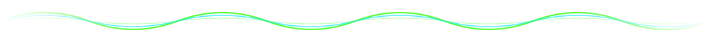
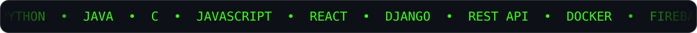

<!--
  ============================================================
  SETUP: replace every occurrence of shawdi1557 with
  your real GitHub username (see the setup instructions).
  Linux/macOS:  sed -i 's/shawdi1557/yourname/g' README.md
  ============================================================
-->

  <b>B.Tech Computer Science Graduate</b> &nbsp;|&nbsp; <b>Software Developer at MINTS GLOBAL</b> 
  Interested in modern software engineering, AI, cloud technologies and cybersecurity. 
  I love building useful products and experimenting with new technologies.

 

<!-- ======================= GITHUB ACTIVITY ======================= -->

<h2 align="center"></h2>

  
  
  
  

<!-- Current streak, longest streak and total contributions -->

 

<!-- ======================= CONTRIBUTION SNAKE ======================= -->

<h2 align="center"></h2>

<!-- Generated by .github/workflows/snake.yml and stored on the "output" branch -->
<picture>
  <source media="(prefers-color-scheme: dark)" srcset="https://raw.githubusercontent.com/shawdi1557/shawdi1557/output/github-contribution-grid-snake-dark.svg" />
  <source media="(prefers-color-scheme: light)" srcset="https://raw.githubusercontent.com/shawdi1557/shawdi1557/output/github-contribution-grid-snake.svg" />
  
</picture>

 

<!-- ======================= CONTRIBUTION GRAPH ======================= -->

<h2 align="center"></h2>

 

<!-- ======================= ACHIEVEMENTS ======================= -->

<h2 align="center"></h2>

<!-- Stars, commits, pull requests, issues and repositories, all live -->

<!--
  OFFICIAL GITHUB ACHIEVEMENT BADGES (Pull Shark, YOLO, Quickdraw, Pair Extraordinaire, Galaxy Brain, ...)
  GitHub has no API for these, so they cannot be fetched dynamically and are NOT claimed here.
  To show the ones you have earned:
    1. Open https://github.com/shawdi1557?tab=achievements
    2. Right-click a badge > Copy image address
    3. Uncomment the block below and paste each URL, delete the rows you have not earned.

 
<table>
  <tr>
    <td align="center"> Pull Shark</td>
    <td align="center"> YOLO</td>
    <td align="center"> Quickdraw</td>
  </tr>
</table>
-->

 

<!-- ======================= MOST USED LANGUAGES ======================= -->

<h2 align="center"></h2>

 

<!-- ======================= TECH STACK ======================= -->

<h2 align="center"></h2>

<h4>Languages</h4>

  
  
  
  

<h4>Frontend</h4>

  
  
  

<h4>Backend</h4>

  
  

<h4>Database and Backend Services</h4>

  
  
  

<h4>DevOps and Version Control</h4>

  
  

<h4>Design and Creative</h4>

  
  
  
  

 

<!-- ======================= CURRENTLY WORKING ON ======================= -->

<h2 align="center"></h2>

 

<!-- ======================= CONNECT ======================= -->

<h2 align="center"></h2>

  
  
  
  
  
  

 

<!-- ======================= CONTACT ======================= -->

<h2 align="center"></h2>

  

 

<!-- ======================= FOOTER ======================= -->

